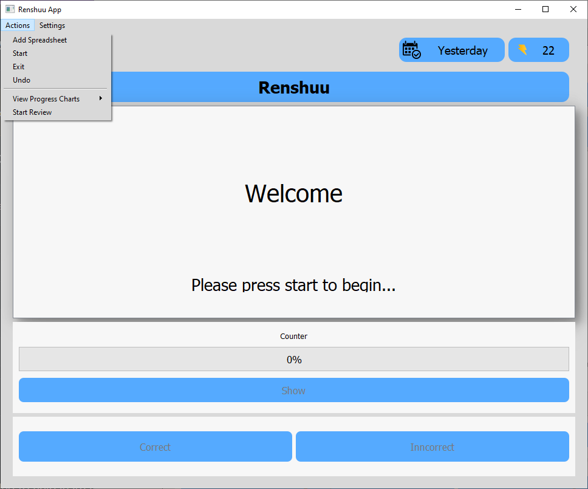
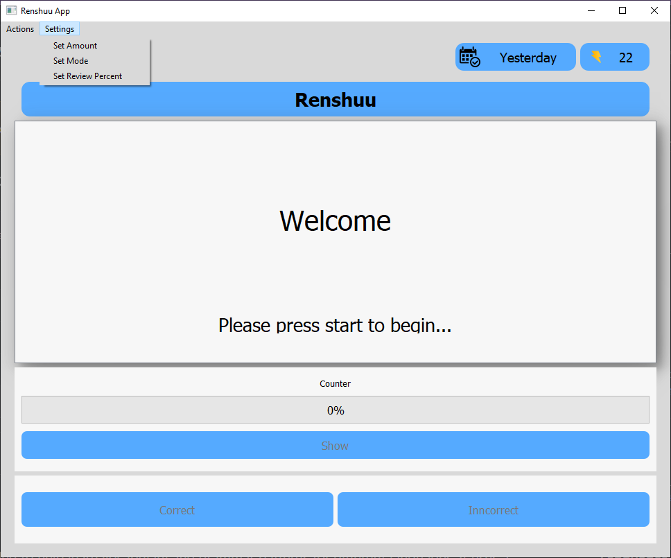

# Vocabulary-Practice-App

This is an application intended to help learn vocabulary and grammar patterns for different languages. It uses a Graphical User Interface (GUI) to help users practice these in a simple and intuitive manner.

## Setup

To use the app, first, you need to create any spreadsheet that is formatted to with columns for "Vocabulary", "Spelling", "Translation". From here you can fill out as many vocabulary terms and grammar patterns within these columns. Once you want to use the application to practice these, convert the spreadshet into a ".csv" file. Afterwards, run the application which will show the following interface:

## Actions

Here shows the "Action" tab, which provides inputs to use the application:

### Adding a Spreadsheet
Here go to "Actions" on the top menu-bar and click on "Add Spreadsheet". This will allow you to browse through you files for the ".csv" file of your spreadsheet. 

### Starting Practice
In the "Actions" tab, you can click "Start" to begin. By default it will test you with 10 things from the spreadsheet and it will be on the vocabulary terms and grammar patterns in the other language you are learning. In the following sections, it will cover how to use the "Settings" tab to change to practice parameters that is available. When you start a practice, you will prompted with a random "practice card" where you can attempt to translate, write, pronounce, etc. Then you can use the buttons on the lower-half of the app to show the answer and record if it was correct/incorrect. Whether it is correct or incorrect will be logged for reviewing, which will be mentioned in a later section. The other actions you can do is "Exit" and "Undo". This allows you to exit your current practice session and undo the previous input, respectively.

### Progression Charts
In the "Actions" tab, you can also check your progression on daily, week, and weekly intervals. This will show charts to see how much improvement is made or is needed. Below showcases an example of my progression learning Japanese at the time making this markdown file:

### Reviews
In the "Actions" tab, you can click "Start Review" to review previous incorrect vocabulary terms and grammar patterns within the week. By default, it reviews 10% of the incorrect terms within that week. However, this can be changed in the "Settings" tab. Something to note is that the review terms are logged in the same fashion as it would in regular practice sessions. In the current version of this app, it does not have any form of weighting to select terms to review, but it is planned in the future to take the frequency of an incorrect term into account.

## Settings

Below shows the "Settings" tab, which lets users to modify the parameters to affect how practice sessions are done.

### Practice Amount
If you want to change the amount of vocabulary terms and grammar patterns to practice, go to "Settings" at the top menu-bar. Here you can click the "Set Amount", which will make a prompt to enter a numeric amount to change how many to practice for. 

### Practice Mode
You can set the practice mode by clicking the "Set Mode" option, which will also make a prompt to select either "Practice Vocab" or "Practice Translations". "Practice Vocab" will test you on the vocabulary terms and grammar patterns in the other language. "Practice Translations" will test you on the translations of those vocabulary terms and grammar patterns.

### Review Percentage
You can adjust the review percentage by clicking the "Set Review Percentage" option. This will allow you to insert a percentage that will affect the number of incorrect terms you will review on during the review sessions.
