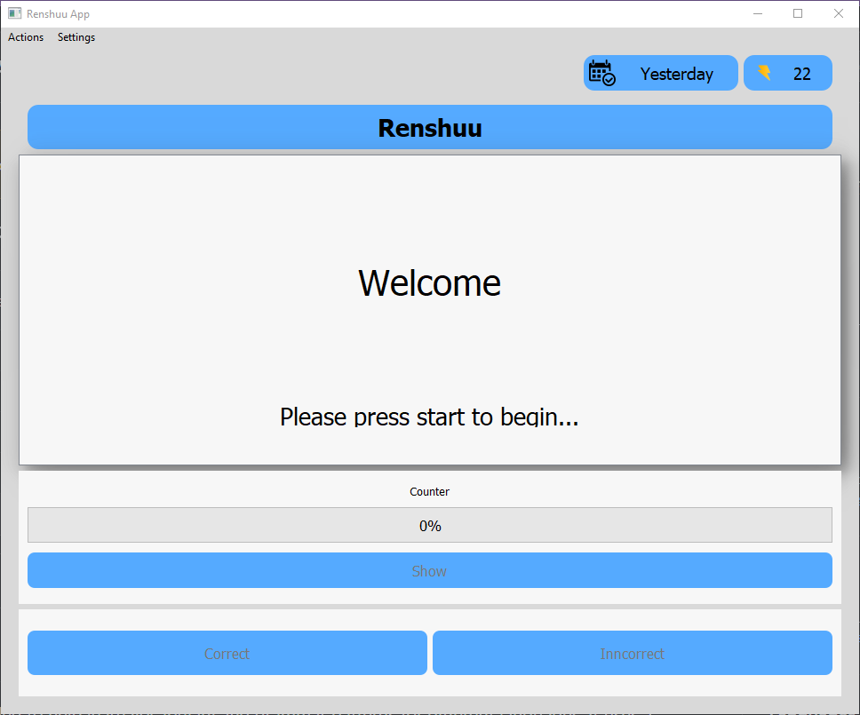

# Vocabulary-Practice-App

This is an application intended to help learn vocabulary and grammar patterns for different languages. It uses a Graphical User Interface (GUI) to help users practice these in a simple and intuitive manner.

## How to Use

To use the app, first, you need to create any spreadsheet that is formatted to with columns for "Vocab", "Spelling", "Translation". From here you can fill out as many vocabulary terms and grammar patterns within these columns. Once you want to use the application to practice these, convert the spreadshet into a ".csv" file. Afterwards, run the application which will show the following interface:

Here go to "Actions" on the top menu-bar and click on "Add Spreadsheet". This will allow you to browse through you files for the ".csv" file of your spreadsheet. After words you can click "Start" to begin.

If you want to change the amount of vocabulary terms and grammar patterns to practice, go to "Settings" at the top menu-bar. Here you can click the "Set Amount", which will make a prompt to enter a numeric amount to change how many to practice for. Additionally, you can set the practice mode by 

